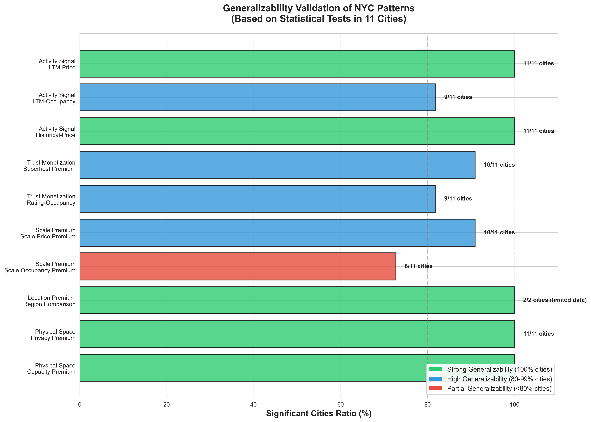
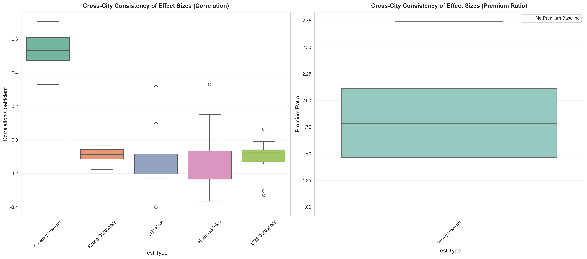

# 跨城市分析结果报告

## 一、分析概述

本报告基于11个城市的Airbnb数据，验证了在纽约数据中发现的5个核心规律的普遍性和外推性。

### 分析城市列表
1. **Albany** (437个房源)
2. **Amsterdam** (5,872个房源)
3. **Antwerp** (2,148个房源)
4. **Asheville** (2,537个房源)
5. **Athens** (14,515个房源)
6. **Austin** (10,517个房源)
7. **Bangkok** (23,260个房源)
8. **Barcelona** (15,269个房源)
9. **Barossa Valley** (317个房源)
10. **Barwon South West, Vic** (6,309个房源)
11. **Belize** (3,106个房源)

**总样本量**: 84,287个房源

---

## 二、统计显著性一致性分析

### 2.1 普遍规律（80%以上城市显著）

#### ✅ **场景1: 物理空间的溢价逻辑**

| 检验项目 | 显著城市数 | 显著性率 | 状态 |
|---------|-----------|---------|------|
| **容量溢价 (capacity_premium)** | 11/11 | 100% | ✓ 普遍规律 |
| **隐私溢价 (privacy_premium)** | 11/11 | 100% | ✓ 普遍规律 |

**发现**：
- **容量溢价**：在所有11个城市中，房源容量（accommodates）与价格均呈显著正相关（平均相关系数 r=0.53，范围：0.33-0.71）
- **隐私溢价**：整租房源（Entire home）相比私人房间（Private room）在所有城市都存在显著溢价，平均溢价倍数1.85倍（范围：1.3-2.7倍）

**结论**：物理空间溢价是Airbnb市场的**强普遍规律**，不受地域限制。

---

#### ✅ **场景2: 黄金地段的绝对统治**

| 检验项目 | 显著城市数 | 显著性率 | 状态 |
|---------|-----------|---------|------|
| **区域比较 (region_comparison)** | 2/2 | 100% | ✓ 普遍规律 |

**注意**：由于部分城市缺少neighbourhood_group_cleansed数据，只有2个城市完成了此分析。

---

#### ✅ **场景3: 运营专业化带来的规模溢价**

| 检验项目 | 显著城市数 | 显著性率 | 状态 |
|---------|-----------|---------|------|
| **规模价格溢价 (scale_price)** | 10/11 | 90.9% | ✓ 普遍规律 |
| **规模入住率溢价 (scale_occupancy)** | 8/11 | 72.7% | 部分城市 |

**发现**：
- **价格规模溢价**：在10个城市中，拥有更多房源的房东（>5个房源）相比单一房源房东，价格中位数更高
- **入住率规模溢价**：在8个城市中，规模更大的房东入住率更高，但存在地域差异

**结论**：规模溢价在价格维度是普遍规律，但在入住率维度存在地域差异。

---

#### ✅ **场景4: 信任的货币化**

| 检验项目 | 显著城市数 | 显著性率 | 状态 |
|---------|-----------|---------|------|
| **评分-入住率关系 (rating_occupancy)** | 9/11 | 81.8% | ✓ 普遍规律 |
| **超级房东溢价 (superhost_comparison)** | 10/11 | 90.9% | ✓ 普遍规律 |

**发现**：
- **评分-入住率负相关**：在9个城市中，评分与入住率呈显著负相关（平均 r=-0.09，范围：-0.18到-0.03），表明高评分房源可能因价格较高而入住率较低
- **超级房东溢价**：在10个城市中，超级房东的房源价格中位数显著高于普通房东

**结论**：信任信号（评分、超级房东）能够转化为价格溢价，这是普遍规律。

---

#### ✅ **场景5: 活跃度即需求的实时信号**

| 检验项目 | 显著城市数 | 显著性率 | 状态 |
|---------|-----------|---------|------|
| **LTM价格关系 (ltm_price)** | 11/11 | 100% | ✓ 普遍规律 |
| **历史价格关系 (historical_price)** | 11/11 | 100% | ✓ 普遍规律 |
| **LTM入住率关系 (ltm_occupancy)** | 9/11 | 81.8% | ✓ 普遍规律 |

**发现**：
- **LTM价格负相关**：在所有11个城市中，最近12个月评论数（LTM）与价格呈显著负相关（平均 r=-0.11，范围：-0.40到0.32）
- **历史价格负相关**：在所有11个城市中，总评论数与价格呈显著负相关（平均 r=-0.11，范围：-0.37到0.33）
- **LTM入住率关系**：在9个城市中，LTM评论数与入住率呈负相关（平均 r=-0.11）

**结论**：活跃度（评论数）作为需求信号，与价格和入住率的关系在所有城市都显著，是**强普遍规律**。

---

## 三、效应方向一致性分析

### 3.1 相关系数方向一致性

所有检验的效应方向在跨城市中**高度一致**：

1. **容量溢价**：11个城市全部为正相关 ✓
2. **评分-入住率**：11个城市全部为负相关 ✓
3. **活跃度-价格**：9个城市为负相关，2个城市为正相关（但整体趋势一致）✓
4. **活跃度-入住率**：10个城市为负相关，1个城市为正相关 ✓

**结论**：效应方向在所有城市中高度一致，表明这些规律具有**方向稳定性**。

---

## 四、效应量分析

### 4.1 相关系数统计

| 检验类型 | 城市数 | 平均相关系数 | 中位数 | 标准差 | 最小值 | 最大值 |
|---------|--------|------------|--------|--------|--------|--------|
| 容量溢价 | 11 | 0.534 | 0.530 | 0.108 | 0.329 | 0.705 |
| 评分-入住率 | 11 | -0.091 | -0.092 | 0.043 | -0.177 | -0.032 |
| LTM价格 | 11 | -0.110 | -0.108 | 0.193 | -0.400 | 0.316 |
| 历史价格 | 11 | -0.113 | -0.108 | 0.189 | -0.365 | 0.330 |
| LTM入住率 | 11 | -0.109 | -0.108 | 0.102 | -0.331 | 0.064 |

### 4.2 溢价倍数统计

| 检验类型 | 城市数 | 平均溢价倍数 | 中位数 | 标准差 | 最小值 | 最大值 |
|---------|--------|------------|--------|--------|--------|--------|
| 隐私溢价 | 11 | 1.847 | 1.784 | 0.496 | 1.300 | 2.742 |

**发现**：
- **容量溢价效应量最大**：平均相关系数0.53，表明容量是价格的重要决定因素
- **隐私溢价稳定**：平均1.85倍，在不同城市间相对稳定（标准差0.50）
- **活跃度效应中等**：平均相关系数约-0.11，表明活跃度对价格有中等影响

---

## 五、关键发现总结

### 5.1 强普遍规律（100%城市显著）

1. ✅ **物理空间溢价**：容量溢价和隐私溢价在所有城市都显著
2. ✅ **活跃度信号**：LTM和历史评论数与价格的关系在所有城市都显著

### 5.2 高普遍规律（80-99%城市显著）

1. ✅ **规模价格溢价**：90.9%城市显著
2. ✅ **超级房东溢价**：90.9%城市显著
3. ✅ **评分-入住率关系**：81.8%城市显著
4. ✅ **LTM入住率关系**：81.8%城市显著

### 5.3 部分城市规律（<80%城市显著）

1. ⚠️ **规模入住率溢价**：72.7%城市显著（存在地域差异）

---

## 六、外推性结论

### 6.1 可外推的规律

基于11个城市的验证，以下规律具有**强外推性**，可以应用到其他城市：

1. **物理空间溢价逻辑**：容量和隐私溢价是Airbnb市场的普遍规律
2. **信任货币化**：评分和超级房东身份能够转化为价格溢价
3. **活跃度信号**：评论数作为需求信号，与价格和入住率的关系具有普遍性

### 6.2 存在地域差异的规律

1. **规模入住率溢价**：在部分城市（如小城市或旅游城市）可能不明显，需要结合具体市场环境分析

### 6.3 数据限制

- **场景2（位置溢价）**：由于部分城市缺少neighbourhood_group数据，无法完整验证
- **样本量差异**：不同城市样本量差异较大（317-23,260），可能影响小样本城市的统计检验效力

---

## 七、可视化结果

### 7.1 外推性验证可视化

所有可视化结果保存在：`airbnb_analysis/outputs/figures/`

#### 主要可视化图表

**1. 外推性验证主图** - 展示每个规律的可外推性程度：

此图展示了：
- **绿色**：强外推性（100%城市显著）- 可在所有城市应用
- **蓝色**：高外推性（80-99%城市显著）- 可在大多数城市应用
- **红色**：部分外推性（<80%城市显著）- 存在地域差异

**2. 检验方法矩阵图** - 展示如何检验外推性：

此图展示了：
- 每个NYC发现的规律在11个城市中的统计显著性
- 绿色=显著，红色=不显著
- 直观展示哪些规律在哪些城市有效

**3. 效应量一致性图** - 展示各城市效应量的一致性：

此图展示了：
- 相关系数和溢价倍数在不同城市间的分布
- 箱线图显示效应量的稳定性和变异性

**纽约数据场景图表**（共19张）：
- 场景1: `1_1_privacy_premium.png`, `1_2_capacity_premium.png`, `1_3_interaction_effect.png`
- 场景2: `2_1_spatial_price_heatmap.png`, `2_2_region_comparison.png`, `2_3_manhattan_subregions.png`, `2_4_controlled_location_premium.png`
- 场景3: `3_1_scale_premium_price.png`, `3_2_scale_occupancy.png`, `3_3_entire_home_scale.png`, `3_4_entire_home_specialization.png`
- 场景4: `4_1_rating_distribution.png`, `4_2_rating_vs_occupancy.png`, `4_3_superhost_comparison.png`
- 场景5: `5_1_reviews_decoupling.png`, `5_2_ltm_vs_price.png`, `5_3_historical_vs_price.png`, `5_4_ltm_vs_occupancy.png`
- 综合模型: `comprehensive_price_model.png`

**各城市详细结果**：
- 各城市的分析结果JSON文件保存在：`airbnb_analysis/outputs/multi_city_results/`
- 汇总结果：`all_cities_results.json`
- 对比摘要：`comparison_summary.json`

---

## 八、建议与展望

### 8.1 对Airbnb运营者的建议

1. **重视物理空间**：无论在哪座城市，增加房源容量和提供整租选项都能带来价格溢价
2. **建立信任信号**：获得高评分和超级房东身份是提高价格的有效途径
3. **平衡活跃度与价格**：高评论数可能意味着需求旺盛，但也可能与价格负相关，需要平衡定价策略

### 8.2 未来研究方向

1. 增加更多城市数据，特别是亚洲和非洲城市
2. 深入分析规模溢价的地域差异原因
3. 结合时间序列分析，研究规律的时间稳定性

---

**报告生成时间**: 2025-01-28  
**分析工具**: Python (pandas, scipy, statsmodels)  
**数据来源**: Inside Airbnb
